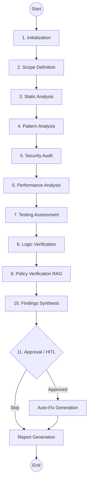

# 🛡️ CodeGuardian: Advanced Agentic Code Review & Debugging System

[](https://www.python.org/downloads/)
[](https://github.com/langchain-ai/langgraph)
[](https://opensource.org/licenses/MIT)

CodeGuardian is an enterprise-grade, AI-powered agent designed to automate the exhaustive process of code review, security auditing, and architectural validation. Built on a sophisticated **LangGraph state machine**, it acts as a virtual Senior Software Engineer, reasoning through code logic, performance bottlenecks, and security vulnerabilities across 11 distinct analysis phases.

## 🚀 Key Features

- **11-Phase Reasoning Pipeline**: A structured workflow moving from repository initialization to deep logic verification and automated reporting.
- **RAG-Enhanced Policy Verification**: Upload your own company-specific coding standards and CodeGuardian will verify your code against local policies using Retrieval-Augmented Generation.
- **Security-First DNA**: Automated detection of CWE Top 25 vulnerabilities, hardcoded secrets, and unsafe system patterns.
- **Performance Profiling**: Identification of high cyclomatic complexity, N+1 query patterns, and algorithmic bottlenecks.
- **Human-in-the-Loop (HITL)**: The agent pauses before applying automated fixes, allowing developers to review and approve proposed changes.
- **Polyglot Design**: Modular analyzer architecture with support for Python, Java, and TypeScript.
- **Synthetic Test Generation**: Automatically creates adversarial test suites to stress-test the logic identified during reviews.
- **Professional Reporting**: Generates interactive Markdown and JSON reports.

## 🛠️ Tech Stack

| Layer | Technologies |
|-------|-------------|
| **Core Engine** | Python 3.12+ |
| **Orchestration** | LangGraph, LangChain |
| **Intelligence** | Google Gemini 2.0 Flash |
| **CLI Interface** | Rich, Click |
| **Code Analysis** | Radon, Pylint, AST Parsing |

## 🏗️ Architecture



## 🏁 Installation & Setup

### Prerequisites
- Python 3.12 or higher
- A Google AI Studio API Key (for Gemini)

### Local Setup

1. **Clone the repository**:
   ```bash
   git clone https://github.com/Ismail-2001/Code-Review-and-Debugging-Agent.git
   cd Code-Review-and-Debugging-Agent
   ```

2. **Install dependencies**:
   ```bash
   pip install -r requirements.txt
   ```

3. **Configure environment**:
   Create a `.env` file in the root directory:
   ```env
   GOOGLE_API_KEY=your_gemini_api_key_here
   GITHUB_TOKEN=your_github_token_optional
   LOG_LEVEL=INFO
   ```

## 📖 Usage

### Review a Local Directory
```bash
python src/main.py review ./path/to/your/project
```

### Review a Remote Repository
```bash
python src/main.py review https://github.com/user/repo --scope full
```

### Run Advanced Scans
```bash
python src/main.py review . --scope diff --severity high --format all
```

## 🚢 Deployment

### GitHub Actions
Use the provided workflow in `.github/workflows/codeguardian.yml` to trigger reviews on every Pull Request.

### Docker
```bash
docker build -t codeguardian .
docker run --env-file .env codeguardian review https://github.com/user/repo
```

## 🗺️ Roadmap

- [ ] Multi-Agent Collaboration for parallelized review
- [ ] IDE Integration (VS Code and IntelliJ plugins)
- [ ] Direct Git Commits with auto-PR creation
- [ ] Advanced Vector Storage with Pinecone

## 🤝 Contributing

1. Fork the Project
2. Create your Feature Branch (`git checkout -b feature/AmazingFeature`)
3. Commit your Changes (`git commit -m 'Add some AmazingFeature'`)
4. Push to the Branch (`git push origin feature/AmazingFeature`)
5. Open a Pull Request

## 📜 License

Distributed under the MIT License. See `LICENSE` for more information.

---

**Developed by Ismail, Advanced Agentic Coding Initiative**
