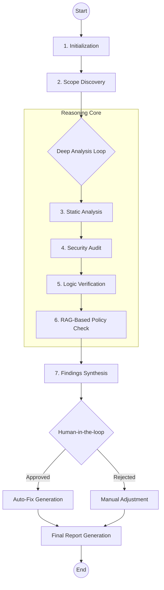

# 🛡️ CodeGuardian: Advanced Agentic Code Review & Debugging System
### *Your Virtual Senior Engineer, Operating at Wire-Speed*

[](https://github.com/Ismail-2001)
[](https://github.com/Ismail-2001)
[](https://github.com/Ismail-2001)

---

## 🎬 Overview
**CodeGuardian** is not just a linter; it’s an **Autonomous Agentic Orchestrator** designed to audit enterprise-grade codebases. By leveraging **LangGraph-based multi-phase reasoning**, it identifies security flaws, architectural debt, and performance bottlenecks, offering self-correcting fixes with human-aligned oversight.

---

## 🏗️ The Intelligence Architecture
CodeGuardian operates on a multi-layered cognitive loop. Below is the rendered reasoning pipeline:



---

## 🚀 Key Features
- **11-Phase Reasoning Pipeline:** Structured workflow from repo init to deep logic verification.
- **Security-First DNA:** Automated detection of CWE Top 25, hardcoded secrets, and unsafe patterns.
- **RAG-Enhanced Policies:** Use **Retrieval-Augmented Generation** to audit code against *your* custom company standards.
- **Human-in-the-Loop (HITL):** Strategic pauses for developer approval before executing automated code refactoring.
- **Adversarial Test Generation:** Automatically creates synthetic test suites to stress-test your logic.

---

## 📊 Sample Review Report (Output Snippet)
```markdown
### 🔎 Finding ID: SEC-001
- **Severity:** High
- **Issue:** SQL Injection vulnerability detected in `src/db_handler.py:45`.
- **Reasoning:** User-input is directly concatenated into the query string.
- **Proposed Fix:** Parameterized query implementation.
- **Confidence Score:** 98%
```

---

## 🏁 Quick Start
### Prerequisites
- Python 3.10+
- OpenAI / DeepSeek API Key

### Local Setup
```bash
git clone https://github.com/Ismail-2001/Code-Review-and-Debugging-Agent.git
cd Code-Review-and-Debugging-Agent
pip install -r requirements.txt
python main.py --path ./your_project_directory
```

---

## 🗺️ Roadmap
- [ ] Integration with GitLab & Bitbucket.
- [ ] Real-time Streaming Reports.
- [ ] Advanced Graph-based call-chain visualization.

---

### 🔗 Connecting the Intelligence
Developed by **[Ismail Sajid](https://ismail-sajid-agentic-portfolio.netlify.app/)**. 
*Explore more Autonomous Agents on my [Main Profile](https://github.com/Ismail-2001).*

---
