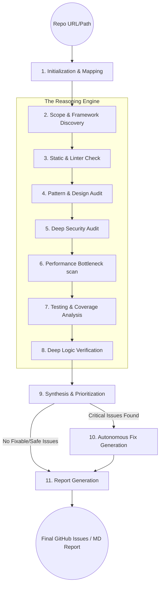

<div align="center">

# 🛡️ CodeGuardian: Cognitive Code Review & Debugging Agent
### A Production-Grade Autonomous Orchestrator Powered by LangGraph & DeepSeek-V3

<br/>

[](https://python.org)
[](https://langchain-ai.github.io/langgraph/)
[](https://deepseek.com)
[](https://owasp.org)
[](./LICENSE)

<br/>

> *"CodeGuardian is more than a linter—it's a virtual senior developer that reasons about your architecture, identifies silent logic failures, and autonomously generates surgical code repairs."*

**CodeGuardian** is an enterprise-grade autonomous system designed for deep code auditing and self-correction. Built on a **LangGraph-based cyclic architecture**, it transcends standard static analysis by employing **11 specialized reasoning nodes** that simulate the mental model of a senior staff engineer.

[**🏗️ Architecture**](#-system-architecture) · [**🧠 Reasoning Core**](#-the-cognitive-pipeline) · [**🚀 Quick Start**](#-getting-started) · [**📊 Reporting**](#-enterprise-reporting)

---

</div>

## 📌 The "Code Rot" Challenge

Enterprise codebases fail not just due to syntax errors, but because of:
1.  **Invisible Logic Breaches**: Code that runs but produces incorrect outcomes.
2.  **Architectural Drift**: Intentional patterns being ignored over time.
3.  **Security Gaps**: Hardcoded secrets or unsafe parsing that static linters miss.
4.  **Review Fatigue**: Human reviewers missing subtle concurrency or performance issues.

**CodeGuardian solves this** by treating code review as an agentic workflow. It doesn't just "check" code; it **reasons** about it across multiple specialized dimensions.

---

## ✨ Enterprise Capabilities

### ⚡ Agentic Self-Correction (Auto-Fix)
Powered by the `generate_fixes` node, CodeGuardian doesn't just point out problems—it proposes solutions. 
- **Safe-Only Refactoring**: Automatically addresses medium-to-high severity issues that have high confidence scores.
- **Human-in-the-loop (HITL)**: Advanced configuration allows for mandatory developer approval before applying security or architectural fixes.

### 🛡️ 11-Phase Intelligence Pipeline
CodeGuardian executes a strictly orchestrated workflow defined in `graph.py`:
- **Static Analysis**: Pylint/Flake8/ESLint integration.
- **Pattern Matching**: Detects anti-patterns and suboptimal "code smells".
- **Security Audit**: Scans for CWE Top 25, insecure dependencies, and secret leakage.
- **Performance Profiling**: Identifies N+1 queries, memory bottlenecks, and complexity spikes.
- **Testing Assessment**: Audits test coverage and identifies "missing edge-case" scenarios.
- **Logic Verification**: Deep reasoning about function intent vs. implementation.

### ⚙️ Declarative Configuration (`.codeguardian.yml`)
Manage your entire audit policy with a production-grade YAML spec:
- Define excluded/included directory patterns.
- Set complexity thresholds (Cyclomatic/Cognitive).
- Configure language-specific linter rules.
- Enable/Disable specific agent nodes based on performance needs.

---

## 🏗️ System Architecture

### The Cognitive Execution Graph



---

## 📊 Enterprise Reporting Suite

CodeGuardian generates high-fidelity reports tailored for different stakeholders:
- **Markdown Summary**: Optimized for GitHub Action logs and PR comments.
- **JSON Structured Data**: For integration into existing CI/CD dashboards (Datadog/ELK).
- **GitHub Issues Integration**: Automatically creates and labels issues for discovered vulnerabilities.

### Sample Finding Snippet:
```markdown
### 🕵️ Finding: SEC-024 (Insecure SQL Handling)
- **Severity**: 🔴 CRITICAL
- **Location**: `src/db/manager.py:84`
- **Reasoning**: User-controlled string 'query_tag' is directly interpolated into a raw SQL string, bypassing ORM protections.
- **Recommendation**: Use a parameterized query or the helper method `safe_execute()`.
- **Auto-Fix Generated**: ✅ YES (See PR Preview)
```

---

## 🚀 Getting Started

### 1. Installation
```bash
git clone https://github.com/Ismail-2001/Code-Review-and-Debugging-Agent.git
cd Code-Review-and-Debugging-Agent
pip install -r requirements.txt
```

### 2. Configuration
Create a `.env` file in the root:
```env
OPENAI_API_KEY=sk-...
# OR
DEEPSEEK_API_KEY=sk-...
```

Configure your standards in `.codeguardian.yml`.

### 3. Run Your First Review
```bash
# Analyze a local project
python main.py --path /path/to/your/project --severity high

# Analyze a specific branch
python main.py --path /path/to/repo --branch feature/login-security
```

---

## 🔭 The Lab Roadmap

### ✅ Completed
- [x] **LangGraph Orchestrator**: Multi-node state machine for reasoning.
- [x] **Stateful Memory**: Preserves context across analysis phases.
- [x] **Configuration Layer**: Full YAML-based control.

### 🔨 Phase 2: Cognitive Depth (Next)
- [ ] **Cross-File Dependency Mapping**: Detecting issues that span multiple modules.
- [ ] **RAG-Powered Policies**: Auditing code against custom enterprise Wiki/Documentation.
- [ ] **Interactive Debugger**: A CLI loop to chat with the agent about specific files.

---

<div align="center">

**Built for staff engineers. Powered by autonomous reasoning.**

*CodeGuardian: Where expertise meets wire-speed.*

Built with ❤️ by [Ismail Sajid](https://github.com/Ismail-2001)

</div>
